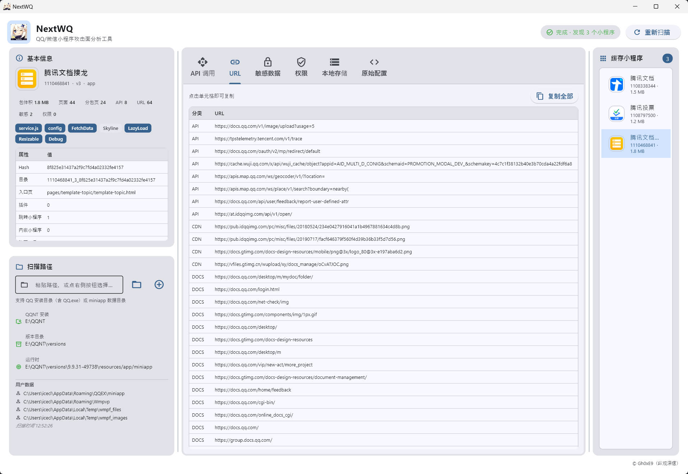
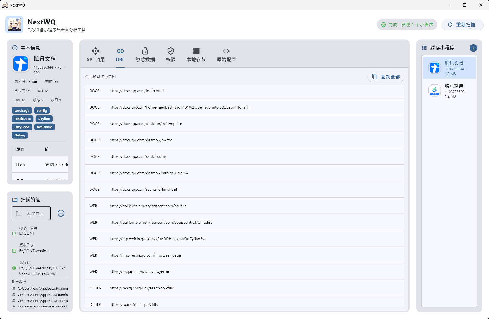

# NextWQ - QQ小程序攻击面分析工具

自动搜索并分析 QQNT 中的小程序，并提供良好的界面显示，帮助红队人员快速扩大攻击面，有啥新的想法可以提出来，目前还在完善当中，预计添加更多功能

## Feature

- **自动路径检测** — 扫描注册表、进程、常见路径定位QQNT安装和数据目录
- **小程序识别** — 解析 `app-config.json` 显示小程序名称、AppID、版本
- **API调用分析** — 提取所有 `wx.*` / `qq.*` API调用，按类别统计
- **URL提取** — 发现所有网络请求URL，分类为 **API/CDN/文档/第三方**
- **敏感信息检测** — 检测 Token、Key、手机号、邮箱、JWT 等敏感数据
- **权限审计** — 分析权限请求并标注安全关注点
- **风险评分** — 综合评估小程序风险等级(0-100)
- **数据存储浏览** — 查看 `fetchData`、`auth`、`localStorage`、文件系统

目前仅支持 Windows 版本，后续会逐渐适配 MacOS/Linux，等我电脑修好了（

## Screenshot

## Alert

**免责声明：**本工具仅用于网络安全技术研究、教学及合规的渗透测试，旨在帮助提升系统安全性。使用者在使用本工具时须严格遵守当地法律法规，严禁将本工具用于任何未经授权的非法活动或破坏性攻击，因滥用本工具所导致的任何直接或间接法律责任及后果，均由使用者本人承担，开发者对此不承担任何责任，使用本工具即视为您已理解并同意本声明。

**纵观深信（Gh0xE9）实验室出品**

